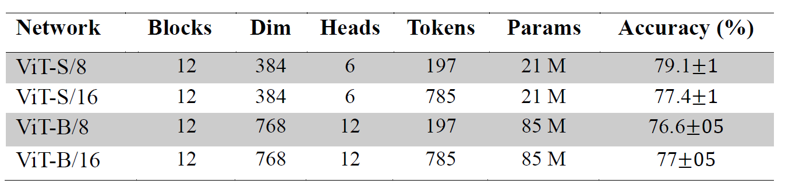

# Local-to-Global Self-Supervised Representation Learning for Diabetic Retinopathy Grading

This is a PyTorch implementation for our paper "**Local-to-Global Self-Supervised Representation Learning for Diabetic Retinopathy Grading**".
[[`arXiv`](https://arxiv.org/abs/2410.00779)]

Artificial intelligence algorithms have demonstrated their image classification and segmentation ability in the past decade. However, artificial intelligence algorithms perform less for actual clinical data than those used for simulations. This research aims to present a novel hybrid learning model using self-supervised learning and knowledge distillation, which can achieve sufficient generalization and robustness. The self-attention mechanism and tokens employed in ViT, besides the local-to-global learning approach used in the hybrid model, enable the proposed algorithm to extract a high-dimensional and high-quality feature space from images. To demonstrate the proposed neural network's capability in classifying and extracting feature spaces from medical images, we use it on a dataset of Diabetic Retinopathy images,specifically the EyePACS dataset. This dataset is more complex structurally and challenging regarding damaged areas than other medical images. For the first time in this study, self-supervised learning and knowledge distillation are used to classify this dataset. In our algorithm, for the first time among all self-supervised learning and knowledge distillation models, the test dataset is 50% larger than the training dataset. Unlike many studies, we have not removed any images from the dataset. Finally, our algorithm achieved an accuracy of 79.1 in the linear classifier and 74.36% in the k-NN algorithm for multiclass classification. Compared to a similar state-of-the-art model, our results achieved higher accuracy and more effective representation spaces.


## Dataset
We utilized the Kaggle EyePACS dataset, the largest publicly available dataset for classifying DR images, consisting of retinal images collected from American patients. This dataset is divided into a training set comprising 35,126 images and a test set containing 53,576 images. The images were captured using various types and models of cameras. The dataset is annotated into five classes based on the severity of DR: no DR (class 0), mild DR (class 1), moderate DR (class 2), severe DR (class 3), and proliferative DR (class 4). The EyePACS dataset presents several challenges, including uneven illumination, color distortion, low contrast, motion blur, and the absence of key anatomical features such as the fovea or optic disc.

## Settings

### Envirment
lease install [PyTorch](https://pytorch.org/) and download the [EyePACS](https://www.kaggle.com/competitions/diabetic-retinopathy-detection/data/) dataset.
This codebase has been developed with python version 3.8, PyYAML 6.0.1, PyTorch version 2.0.0, CUDA 11.8 and torchvision 0.15.1.

### Training
We initialize both the student and teacher networks using pre-trained ViT models trained on ImageNet. Our network is trained for 90 epochs on a single RTX 3090 GPU, with the ViT-B/8 variant requiring approximately 50 hours for completion.
```
python3 -m torch.distributed.launch --nproc_per_node=1 SSRL.py
```

## Evaluation
Our research employs three protocols to evaluate the trained network: Linear classification, k-NN classifier, and Self-attention visualization.

### Linear classification
A linear classification layer is added at the end of the model for evaluation. The output dimensions of this layer correspond to the number of classes in the evaluation dataset. During evaluation, only this linear layer is trained.
<div align="center">
  
</div>


### K-NN classifier
We employed k-NN classification with cosine similarity, which is particularly effective in high-dimensional feature spaces. For k = 15, our approach achieved an accuracy of 74.36%.


### Self-attention visualization
Representing the self-attention space for the CLS token from the last layer of a ViT-S/8 can provide fundamental insights into which parts of the input image are most effective for classification and segmentation. 
<div align="center">
  
</div>


## License
This repository is released under the Apache 2.0 license as found in the [LICENSE](LICENSE) file.

## Citation
If you find this repository useful, please consider giving a star :star: and citation :t-rex::
```
@inproceedings{,
  title={Local-to-Global Self-Supervised Representation Learning for Diabetic Retinopathy Grading},
  author={Mostafa Hajighasemlou, Samad Sheikhaei, Hamid Soltanian-Zadeh},
  booktitle={arXiv preprint arXiv:2410.00779},
  year={2024}
}
```
